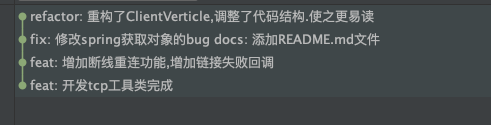

---
categories:
  - git
tags:
  - git
date: Sat Apr 10 2021 14:20:13 GMT+0800 (中国标准时间)
author: 深海如梦
excerpt: git的运用操作
cover: ../pic/a145b3dc-f7ad-4797-afc3-1187e214a171.png
---


# git的运用操作


#### git init 项目名

ls 显示出内容

#### git clone 远程仓库地址

例子：git clone git@gitee.com:willern/vue-demo.git


使用 git clone 拷贝一个 Git 仓库到本地，让自己能够查看该项目，或者进行修改。

如果你需要与他人合作一个项目，或者想要复制一个项目，看看代码，你就可以克隆那个项目。 执行命令：


## 基本快照

Git 的工作就是创建和保存你的项目的快照及与之后的快照进行对比。本章将对有关创建与提交你的项目的快照的命令作介绍。

git add 命令可将该文件添加到缓存，如我们添加以下两个文件：

```
//touch是新建文件的意思 
touch README
touch hello.php
```

### git add

//代表添加当前项目的所有文件。

git add .

//只添加一个文件 

git add hello.text


#### git status

git status 以查看在你上次提交之后是否有修改。


修改 README 文件：

```
vim README
```


### git diff

执行 git diff 来查看执行 git status 的结果的详细信息。

git diff 命令显示已写入缓存与已修改但尚未写入缓存的改动的区别。git diff 有两个主要的应用场景。


### git commit 提交到仓库

使用 git add 命令将想要快照的内容写入缓存区， 而执行 git commit 将缓存区内容添加到仓库中。

Git 为你的每一个提交都记录你的名字与电子邮箱地址，所以第一步需要配置用户名和邮箱地址。

```
$ git config --global user.name 'runoob'
$ git config --global user.email test@runoob.com
```

接下来我们写入缓存，并提交对 hello.php 的所有改动。在首个例子中，我们使用 -m 选项以在命令行中提供提交注释。

```
$ git add hello.php
$ git status -s
A  README
A  hello.php
$ git commit -m '第一次版本提交'
[master (root-commit) d32cf1f] 第一次版本提交
 2 files changed, 4 insertions(+)
 create mode 100644 README
 create mode 100644 hello.php
 
```

现在我们已经记录了快照。如果我们再执行 git status:

```
$ git status
# On branch master
nothing to commit (working directory clean)
```

以上输出说明我们在最近一次提交之后，没有做任何改动，是一个"working directory clean：干净的工作目录"。

如果你没有设置 -m 选项，Git 会尝试为你打开一个编辑器以填写提交信息。 如果 Git 在你对它的配置中找不到相关信息，默认会打开 vim。屏幕会像这样：


#### git remote -v  查看本地仓库关联的远程仓库情况


#### git push

把本地文件推送到远程仓库下

git push origin master

master 代表默认的主干分支


#### 查看远程分支 git branch -a 

> git branch 列出当前分支清单
>
> git branch -a 查看远程分支和本地分支
>
> git branch -v 查看各个分支最后一个提交信息
>
> git branch --merged 查看哪些分支已经合并入当前分支


#### 创建分支 git checkout -b

git checkout -b 分支名


把本地分支推送到远程

git push --set-upstream origin 分支名 


#### 切换分支

git checkout master

#### 合并分支

git merge master

#### 删除远程分支

git push origin --delete master

#### 删除本地分支

 git branch -d master

#### 


删除远程分支

git push origin --delete master

#### 退回到之前的版本

git reset --hard head^


#### git reflog或git log(git记录) 

查看记录回退版本

git reset --hard HEAD@{1}

git log （按字母q可以退出）


#### 克隆远程分支

git clone -b <指定分支名> <远程仓库地址>


### Vs code git管理

快捷方式

第一步暂存所有更改

第二部点击源代码管理中

确认无误后，在消息中输入信息

然后点击打勾或者快捷键提交，

接着推送上去


vscode git bash  清空屏幕 ctrl+L  快捷键

## git提交规范化


